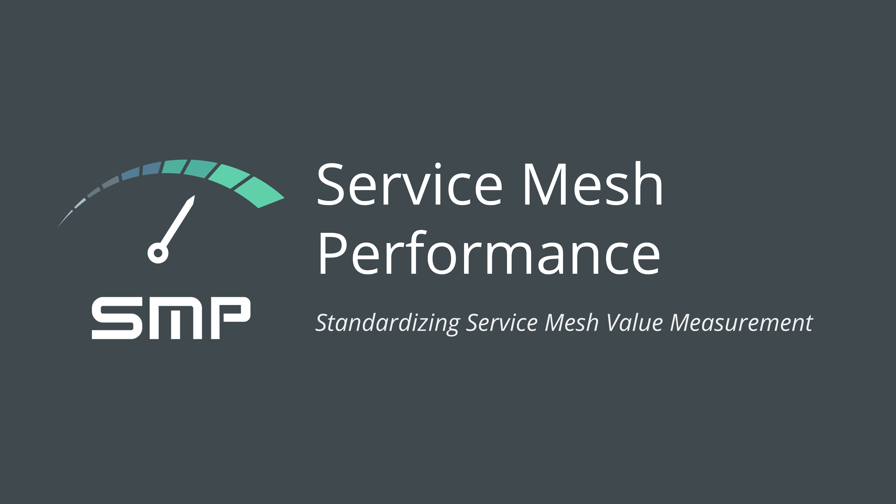

  

<i>If you’re using Service Mesh Performance or if you like the project, please <a href="https://github.com/khulnasoft/service-mesh-performance/stargazers">★</a> star this repository to show your support! 🤩</i>

SMP Community Meetings are now merged into CNCF TAG-network Meetings on the 1st and 3rd Thursday of every month at 9 AM Pacific Time. (<a href="https://docs.google.com/document/d/18hYemFKK_PC_KbT_TDBUgb0rknOuIhikkRxer4_bv4Q/edit">Meeting Minutes</a> | <a href="https://zoom.us/my/cncftagnetwork">Zoom</a>)

# [Service Mesh Performance](https://smp-spec.io) (SMP)
A common format for capturing and describing:

1. performance test configuration
1. service mesh configuration
1. environment configuration
1. workload configuration
1. performance test results

This specification is currently being advanced through the CNCF [Service Mesh WG](https://github.com/cncf/sig-network/tree/master/service-mesh-wg) and the [Meshplay](https://khulnasoft.com/meshplay) project. See a [screenshot](docs/assets/spec/readme/meshplay_benchmark_screen.png) of SMP's canonical implementation.

## Overview

<a href="https://docs.google.com/presentation/d/1fm7Eu1T3JSBPVmdFYyyevqQLSmAMLXqzWqC7QxTHGX8/edit#"><i>Project Overview Presentation</i></a>

<h2>Implementations</h2>
The following projects or products are compatible with / have implemented SMP.

<h3><a href="https://khulnasoft.com/meshplay">Meshplay</a></h3>

<a href="https://meshplay.khulnasoft.com">Meshplay</a> is the multi-service mesh management plane offering lifecycle management of more types of service meshes than any other tool available today. Meshplay facilitates adopting, configuring, operating and managing performance of different service meshes and incorporates the collection and display of metrics from applications running on top of any service mesh.  

See the <a href="docs/assets/spec/readme/service mesh performance result.yaml">sample results</a> file.

  
<i>If you’re using Service Mesh Performance or if you like the project, please <a href="https://github.com/khulnasoft/meshplay/stargazers">★</a> star this repository to show your support! 🤩</i>

<h2> <a href="http://slack.khulnasoft.com">Community</a> and <a href="https://github.com/khulnasoft/service-mesh-performance/blob/master/CONTRIBUTING.md">Contributing</a></h2>
Our projects are community-built and welcome collaboration. 👍 Be sure to see the <a href="https://khulnasoft.com/community/newcomers">KhulnaSoft Newcomers' Guide</a> for a tour of resources available to you and jump into our <a href="http://slack.khulnasoft.com">Slack</a>to engage! Contributors are expected to adhere to the <a href="https://github.com/cncf/foundation/blob/master/code-of-conduct.md">CNCF Code of Conduct</a>.
 
<a href="https://slack.meshplay.khulnasoft.com">

<picture align="right">
  <source media="(prefers-color-scheme: dark)" srcset="docs\assets\spec\readme\slack-dark-128.png"  width="110px" align="right" style="margin-left:10px;margin-top:10px;">
  <source media="(prefers-color-scheme: light)" srcset="docs\assets\spec\readme\slack-128.png" width="110px" align="right" style="margin-left:10px;padding-top:5px;">
  
</picture>
</a>

✔️ <em><strong>Join</strong></em> any or all of the weekly meetings on the <a href="https://calendar.google.com/calendar/b/1?cid=bGF5ZXI1LmlvX2VoMmFhOWRwZjFnNDBlbHZvYzc2MmpucGhzQGdyb3VwLmNhbGVuZGFyLmdvb2dsZS5jb20">community calendar</a>. 
✔️ <em><strong>Watch</strong></em> community <a href="https://www.youtube.com/c/KhulnaSoftio?sub_confirmation=1">meeting recordings</a>. 
✔️ <em><strong>To Access Community Drive,</strong></em> fill <a href="https://docs.google.com/forms/d/e/1FAIpQLSdMLeZY6hZ46yYNkoKKV5OM-jCypjbYcqptbUNltEE73EqCjA/viewform">Community Member Form</a>. 
✔️ <em><strong>Discuss</strong></em> in the <a href="https://discuss.khulnasoft.com">Community Forum</a>. 
✔️ <em><strong>Browse</strong></em> the <a href="https://khulnasoft.com/community/handbook">Community Handbook</a>. 

<i>Not sure where to start?</i> Grab an open issue with the <a href="https://github.com/issues?q=is%3Aopen+is%3Aissue+archived%3Afalse+org%3Akhulnasoft+org%3Ameshplay+org%3Aservice-mesh-performance+org%3Aservice-mesh-patterns+label%3A%22help+wanted%22+">help-wanted label</a>.

## About KhulnaSoft

[KhulnaSoft](https://khulnasoft.com)'s cloud native application and infrastructure management software enables organizations to expect more from their infrastructure. We embrace developer-defined infrastructure. We empower engineer to change how they write applications, support operators in rethinking how they run modern infrastructure and enable product owners to regain full control over their product portfolio.

**License**

This repository and site are available as open source under the terms of the [Apache 2.0 License](https://opensource.org/licenses/Apache-2.0).
